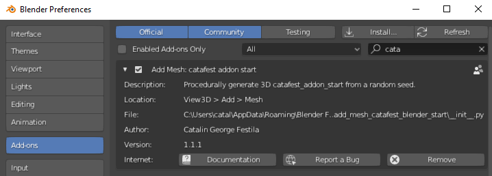
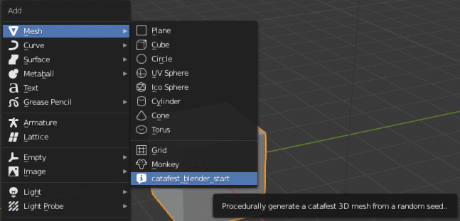
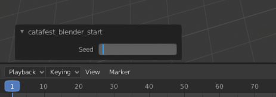

# catafest_blender_start
start with Blender 3D addon for version 2.8

This is a simple addon created today 2020-04-21.

The goal is to show people how easy can use python programming language and Blender 3D software to create custom addons.

The addon just use a default class named *Generate_catafest_mesh*

In this class you can add your source code.

To install this addon download it from her.
Open the Blender 3D software and from Menu - Edit - Preferences... - Add-ons select button Install and select teh zip file.

Use the keys Shift - A and select from menu Mesh and catalin_blender_start

You can see the Seed into left size.

